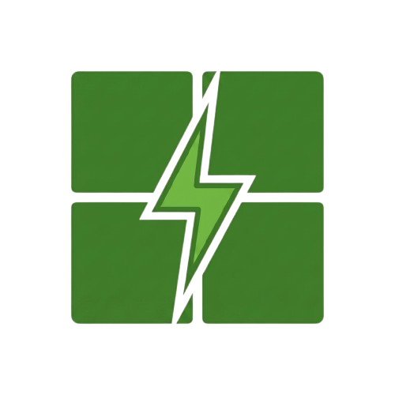

  

<h1 align="center">muxless</h1>

Automatically disables idle NVIDIA GPUs on battery power for muxless gaming laptops, and re-enables them when AC power is connected.

## Features

- Auto-detects NVIDIA GPU via PNP device ID
- Disables GPU only when on battery **and** utilization is below 5%
- Re-enables GPU automatically when AC power is detected
- Uses Windows Task Scheduler — no background service or GUI
- Lightweight, script-based, GitHub distributable

## Requirements

- Windows 10 or 11
- NVIDIA drivers installed (nvidia-smi must be available)
- A muxless laptop (integrated + dedicated GPU, no hardware MUX switch)

## Installation

1. Download `install.bat`
2. Right-click → **Run as Administrator**
3. Done

The installer will:
- Detect your NVIDIA GPU automatically
- Write `manage_gpu.ps1` to `%ProgramData%\muxless\`
- Create two scheduled tasks:
  - **muxless - Manage GPU (logon)** — runs at every user logon
  - **muxless - Manage GPU (poll)** — runs every 2 minutes

## How it works

Every 2 minutes (and at logon), the script checks power state:

| State | Action |
|---|---|
| On AC power | GPU enabled (if it was disabled) |
| On battery, GPU idle (<5%) | GPU disabled |
| On battery, GPU active (≥5%) | No action |

After plugging into AC, the GPU re-enables instantly or within ~2 minutes.

## Uninstallation

Run `uninstall.bat` as Administrator. This removes all tasks and deletes `%ProgramData%\muxless`.

## Notes

- If you reinstall or update NVIDIA drivers, rerun `install.bat` — the GPU device ID can change after a driver reinstall.
- The script uses `Enable-PnpDevice` / `Disable-PnpDevice` via PowerShell running as SYSTEM.
- This script is tested on an Asus vivobook pro 15 laptop which has RTX 3050, The battery life extended from ~1hrs to ~8-11 hrs.
- If you don't want to disable gpu on battery or you don't have an Nvidia GPU but want longer battery life, Search on web for topics like zombie background processes on gpu and resource monitor which prevents mobile GPU from going in a deep sleep state.
